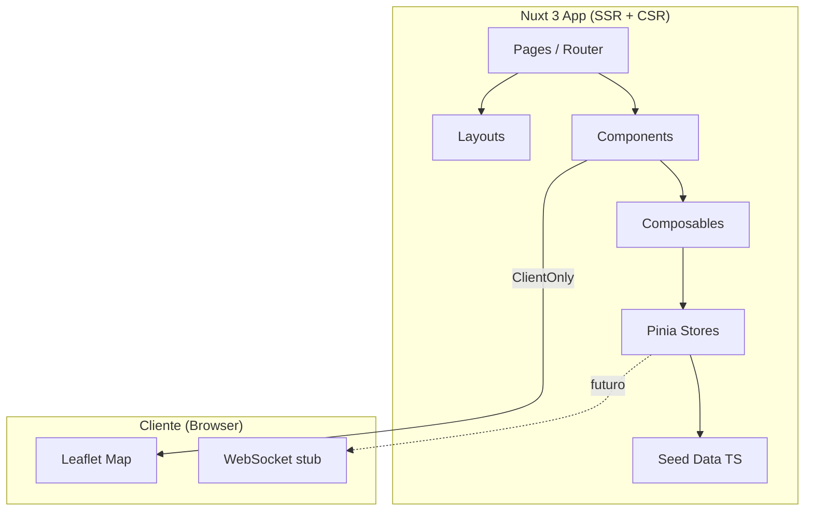

# Design Document — ViaLibre

## Overview

ViaLibre es una aplicación web frontend-only (MVP) construida con Nuxt 3 que visualiza bloqueos carreteros en tiempo real en el estado de Oaxaca, México. La arquitectura del MVP elimina toda dependencia de backend activo: los datos provienen de un archivo TypeScript estático (`frontend/data/incidentes.ts`) y el estado se gestiona localmente con Pinia.

### Decisiones técnicas clave

| Decisión | Justificación |
|---|---|
| Solo frontend con seed data | MVP rápido sin infraestructura; demuestra funcionalidad completa |
| Leaflet + OSM en `<ClientOnly>` | Leaflet requiere `window`; OSM es gratuito y no requiere API key |
| Pinia como fuente de verdad | Estado reactivo centralizado; preparado para migrar a API real |
| NuxtUI v4 + Tailwind | Componentes accesibles out-of-box; paleta custom con tokens |
| TypeScript estricto | Seguridad de tipos para el modelo de dominio complejo |
| Vitest + Vue Test Utils | Testing rápido, compatible con el ecosistema Nuxt |

### Diagrama de arquitectura general



---

## Architecture

### Component Architecture

```mermaid
graph TD
    subgraph "Layouts"
        DefaultLayout[default.vue]
        MapaLayout[mapa.vue]
    end

    subgraph "Pages"
        IndexPage[pages/index.vue]
        MapaPage[pages/mapa.vue]
        ReportarPage[pages/reportar.vue]
        DetallePage[pages/incidentes/[id].vue]
        CuentaPage[pages/cuenta/index.vue]
    end

    subgraph "Components — Incidente"
        IncidenteCard[IncidenteCard.vue]
        IncidenteModal[IncidenteModal.vue]
        IncidenteFormReporte[IncidenteFormReporte.vue]
        IncidenteConfirmaciones[IncidenteConfirmaciones.vue]
    end

    subgraph "Components — Mapa"
        MapaBase[MapaBase.vue]
        MapaMarker[MapaMarker.vue]
        MapaFiltros[MapaFiltros.vue]
        MapaPopup[MapaPopup.vue]
    end

    subgraph "Components — UI"
        LandingHero[LandingHero.vue]
        LandingProblema[LandingProblema.vue]
        LandingPasos[LandingPasos.vue]
        LandingMetricas[LandingMetricas.vue]
        LandingCTA[LandingCTA.vue]
    end

    IndexPage --> DefaultLayout
    IndexPage --> LandingHero
    IndexPage --> LandingProblema
    IndexPage --> LandingPasos
    IndexPage --> LandingMetricas
    IndexPage --> LandingCTA

    MapaPage --> MapaLayout
    MapaPage --> MapaBase
    MapaBase --> MapaMarker
    MapaBase --> MapaPopup
    MapaPage --> MapaFiltros

    ReportarPage --> IncidenteFormReporte
    DetallePage --> IncidenteCard
    DetallePage --> IncidenteConfirmaciones
```

### Componentes — Props y Emits

#### MapaBase.vue

```typescript
// Props
interface MapaBaseProps {
  incidentes: IncidenteType[]
  centro?: [number, number]  // default: [17.0732, -96.7266]
  zoom?: number              // default: 8
}

// Emits
interface MapaBaseEmits {
  (e: 'marker-click', incidente: IncidenteType): void
  (e: 'map-ready', map: L.Map): void
}
```

#### MapaMarker.vue

```typescript
interface MapaMarkerProps {
  incidente: IncidenteType
  activo?: boolean  // si este marcador está seleccionado
}

interface MapaMarkerEmits {
  (e: 'click', incidente: IncidenteType): void
}
```

#### MapaPopup.vue

```typescript
interface MapaPopupProps {
  incidente: IncidenteType
}

interface MapaPopupEmits {
  (e: 'cerrar'): void
  (e: 'ver-detalle', id: string): void
}
```

#### MapaFiltros.vue

```typescript
interface MapaFiltrosProps {
  estadosDisponibles: EstadoIncidente[]
  zonasDisponibles: string[]
  filtrosActivos: FiltrosIncidente
}

interface MapaFiltrosEmits {
  (e: 'update:filtros', filtros: FiltrosIncidente): void
}
```

#### IncidenteCard.vue

```typescript
interface IncidenteCardProps {
  incidente: IncidenteType
  compacto?: boolean  // modo reducido para listas
}

interface IncidenteCardEmits {
  (e: 'ver-detalle', id: string): void
  (e: 'confirmar', id: string): void
  (e: 'negar', id: string): void
}
```

#### IncidenteConfirmaciones.vue

```typescript
interface IncidenteConfirmacionesProps {
  incidente: IncidenteType
  usuarioAutenticado: boolean
  confirmacionUsuario?: ConfirmacionType | null
}

interface IncidenteConfirmacionesEmits {
  (e: 'confirmar', incidenteId: string): void
  (e: 'negar', incidenteId: string): void
}
```

#### IncidenteFormReporte.vue

```typescript
interface IncidenteFormReporteProps {
  usuarioAutenticado: boolean
  coordenadasIniciales?: [number, number] | null
}

interface IncidenteFormReporteEmits {
  (e: 'submit', data: NuevoIncidentePayload): void
  (e: 'cancelar'): void
}
```

---

## Components and Interfaces

### Interfaces de payloads y filtros

```typescript
interface FiltrosIncidente {
  estados: EstadoIncidente[]
  zonas: string[]
}

interface NuevoIncidentePayload {
  titulo: string
  descripcion: string | null
  tipo: TipoIncidente
  latitud: number
  longitud: number
  zona: string
  carretera: string | null
  es_programado: boolean
  inicio_estimado: string | null
  imagen?: File | null
}

type EstadoIncidente = 'programado' | 'activo' | 'finalizado' | 'cancelado' | 'no_verificado' | 'rechazado'

type TipoIncidente = 'bloqueo_sindical' | 'bloqueo_comunitario' | 'manifestacion' | 'derrumbe' | 'accidente' | 'obra' | 'otro'
```

### Funciones puras del dominio (lógica de negocio testeable)

```typescript
// Filtrado de incidentes por criterios
function filtrarIncidentes(
  incidentes: IncidenteType[],
  filtros: FiltrosIncidente
): IncidenteType[]

// Cálculo de confirmación neta
function calcularConfirmacionNeta(incidente: IncidenteType): number

// Evaluación automática de estado basada en confirmaciones
function evaluarEstadoPorConfirmaciones(incidente: IncidenteType): EstadoIncidente | null

// Validación de transiciones de estado
function esTransicionValida(estadoActual: EstadoIncidente, estadoNuevo: EstadoIncidente): boolean

// Color de marcador según estado
function getColorByEstado(estado: EstadoIncidente): string

// Determinar si un marcador debe mostrar ícono de ruta alternativa
function tieneRutaAlternativa(incidente: IncidenteType): boolean

// Validación del formulario de reporte
function validarFormularioReporte(data: Partial<NuevoIncidentePayload>): ValidationResult

// Deduplicación de destinatarios de notificación
function deduplicarDestinatarios(
  suscripciones: SuscripcionType[],
  incidente: IncidenteType
): string[] // usuario_ids únicos
```

---

## Data Models

### Interfaces TypeScript completas

```typescript
// === Entidad principal: Incidente ===
interface IncidenteType {
  id: string
  titulo: string
  descripcion: string | null
  tipo: TipoIncidente
  estado: EstadoIncidente
  latitud: number
  longitud: number
  zona: string
  carretera: string | null
  ruta_alternativa: string | null
  inicio_estimado: string | null  // ISO 8601
  fin_estimado: string | null     // ISO 8601
  fin_real: string | null         // ISO 8601
  reportado_por: string           // usuario_id
  confirmaciones_count: number
  denegaciones_count: number
  created_at: string              // ISO 8601
  updated_at: string              // ISO 8601
}

// === Confirmación comunitaria ===
interface ConfirmacionType {
  id: string
  incidente_id: string
  usuario_id: string
  tipo: 'confirma' | 'niega'
  comentario: string | null
  created_at: string
}

// === Suscripción a alertas ===
interface SuscripcionType {
  id: string
  usuario_id: string
  incidente_id: string | null
  zona: string | null
  canal: 'push' | 'email' | 'sms'
  created_at: string
}

// === Usuario ===
interface UsuarioType {
  id: string
  nombre: string
  email: string
  rol: 'basico' | 'verificado' | 'moderador' | 'admin'
  verificado_en: string | null
  created_at: string
}

// === Notificación ===
interface NotificacionType {
  id: string
  usuario_id: string
  incidente_id: string | null
  tipo: 'cambio_estado' | 'nueva_confirmacion' | 'nuevo_incidente_zona'
  titulo: string
  cuerpo: string
  leida_en: string | null
  created_at: string
}

// === Resultado de validación ===
interface ValidationResult {
  valido: boolean
  errores: Record<string, string[]>
}

// === Transiciones de estado válidas ===
const TRANSICIONES_VALIDAS: Record<EstadoIncidente, EstadoIncidente[]> = {
  programado: ['activo', 'cancelado'],
  activo: ['finalizado'],
  finalizado: [],
  cancelado: [],
  no_verificado: ['activo', 'rechazado'],
  rechazado: []
}
```

---

## Seed Data

### Estructura del archivo `frontend/data/incidentes.ts`

```typescript
import type { IncidenteType } from '~/types'

export const incidentesSeed: IncidenteType[] = [
  {
    id: 'inc-001',
    titulo: 'Bloqueo de la Sección 22 en crucero de Viguera',
    descripcion: 'Maestros de la CNTE bloquean ambos sentidos de la carretera federal 190 a la altura de San Pablo Etla. Se estima que dure hasta las 18:00.',
    tipo: 'bloqueo_sindical',
    estado: 'activo',
    latitud: 17.1245,
    longitud: -96.7891,
    zona: 'Valles Centrales',
    carretera: 'Carretera Federal 190 (Oaxaca-México)',
    ruta_alternativa: 'Tomar la autopista 135D hacia Nochixtlán o desviar por camino a San Agustín Etla.',
    inicio_estimado: '2024-11-15T07:00:00-06:00',
    fin_estimado: '2024-11-15T18:00:00-06:00',
    fin_real: null,
    reportado_por: 'usr-001',
    confirmaciones_count: 12,
    denegaciones_count: 1,
    created_at: '2024-11-15T06:45:00-06:00',
    updated_at: '2024-11-15T08:30:00-06:00'
  },
  {
    id: 'inc-002',
    titulo: 'Derrumbe en curvas de la Sierra Sur km 142',
    descripcion: 'Derrumbe parcial por lluvias que deja un solo carril habilitado. Tránsito lento con bandereros.',
    tipo: 'derrumbe',
    estado: 'activo',
    latitud: 16.2134,
    longitud: -96.4567,
    zona: 'Sierra Sur',
    carretera: 'Carretera 175 (Oaxaca-Puerto Ángel)',
    ruta_alternativa: 'Bajar por carretera 131 hacia Puerto Escondido y luego costera 200 hacia Puerto Ángel.',
    inicio_estimado: null,
    fin_estimado: '2024-11-17T12:00:00-06:00',
    fin_real: null,
    reportado_por: 'usr-003',
    confirmaciones_count: 8,
    denegaciones_count: 0,
    created_at: '2024-11-14T15:20:00-06:00',
    updated_at: '2024-11-15T09:00:00-06:00'
  },
  {
    id: 'inc-003',
    titulo: 'Comunidad de San Bartolo bloquea acceso a autopista',
    descripcion: 'Habitantes de San Bartolo Coyotepec exigen cumplimiento de obra pública. Bloqueo total en el acceso a la 190D.',
    tipo: 'bloqueo_comunitario',
    estado: 'activo',
    latitud: 16.8312,
    longitud: -96.7645,
    zona: 'Valles Centrales',
    carretera: 'Autopista 190D (Oaxaca-Tehuantepec)',
    ruta_alternativa: 'Usar la carretera federal 190 libre por Tlacolula.',
    inicio_estimado: '2024-11-15T06:00:00-06:00',
    fin_estimado: null,
    fin_real: null,
    reportado_por: 'usr-002',
    confirmaciones_count: 15,
    denegaciones_count: 2,
    created_at: '2024-11-15T05:50:00-06:00',
    updated_at: '2024-11-15T10:15:00-06:00'
  },
  {
    id: 'inc-004',
    titulo: 'Manifestación programada del magisterio en el Periférico',
    descripcion: 'La CNTE convoca marcha para el día 18 de noviembre desde Ciudad Administrativa hacia el centro. Se cerrará el periférico norte.',
    tipo: 'manifestacion',
    estado: 'programado',
    latitud: 17.0856,
    longitud: -96.7198,
    zona: 'Valles Centrales',
    carretera: 'Periférico de Oaxaca',
    ruta_alternativa: 'Usar calles internas: Av. Universidad → Camino Nacional → Símbolos Patrios.',
    inicio_estimado: '2024-11-18T09:00:00-06:00',
    fin_estimado: '2024-11-18T14:00:00-06:00',
    fin_real: null,
    reportado_por: 'usr-004',
    confirmaciones_count: 5,
    denegaciones_count: 0,
    created_at: '2024-11-13T12:00:00-06:00',
    updated_at: '2024-11-13T12:00:00-06:00'
  },
  {
    id: 'inc-005',
    titulo: 'Obra de ampliación en costera a la altura de Huatulco',
    descripcion: 'Trabajos de ampliación a 4 carriles entre Pochutla y Huatulco. Tránsito alternado con bandereros.',
    tipo: 'obra',
    estado: 'programado',
    latitud: 15.7690,
    longitud: -96.1345,
    zona: 'Costa',
    carretera: 'Carretera 200 (Costera del Pacífico)',
    ruta_alternativa: null,
    inicio_estimado: '2024-11-20T07:00:00-06:00',
    fin_estimado: '2024-12-20T18:00:00-06:00',
    fin_real: null,
    reportado_por: 'usr-005',
    confirmaciones_count: 3,
    denegaciones_count: 0,
    created_at: '2024-11-10T09:00:00-06:00',
    updated_at: '2024-11-10T09:00:00-06:00'
  },
  {
    id: 'inc-006',
    titulo: 'Bloqueo resuelto en entronque de Mitla',
    descripcion: 'Comerciantes de artesanías bloquearon la entrada a la zona arqueológica por conflicto de permisos. Se levantó tras acuerdo con autoridades.',
    tipo: 'bloqueo_comunitario',
    estado: 'finalizado',
    latitud: 16.9234,
    longitud: -96.3621,
    zona: 'Valles Centrales',
    carretera: 'Carretera Federal 190 (Oaxaca-México)',
    ruta_alternativa: 'Desvío por San Lorenzo Albarradas.',
    inicio_estimado: '2024-11-12T08:00:00-06:00',
    fin_estimado: '2024-11-12T16:00:00-06:00',
    fin_real: '2024-11-12T14:30:00-06:00',
    reportado_por: 'usr-001',
    confirmaciones_count: 9,
    denegaciones_count: 1,
    created_at: '2024-11-12T07:55:00-06:00',
    updated_at: '2024-11-12T14:30:00-06:00'
  },
  {
    id: 'inc-007',
    titulo: 'Accidente de tráiler en bajada a Puerto Escondido',
    descripcion: 'Tráiler volcado en curva km 198. Cierre total mientras retiran unidad con grúa.',
    tipo: 'accidente',
    estado: 'finalizado',
    latitud: 16.0456,
    longitud: -97.0123,
    zona: 'Sierra Sur',
    carretera: 'Carretera 131 (Oaxaca-Puerto Escondido)',
    ruta_alternativa: 'Regresar y tomar carretera 175 por Pochutla como alternativa larga.',
    inicio_estimado: null,
    fin_estimado: null,
    fin_real: '2024-11-14T20:00:00-06:00',
    reportado_por: 'usr-006',
    confirmaciones_count: 6,
    denegaciones_count: 0,
    created_at: '2024-11-14T11:30:00-06:00',
    updated_at: '2024-11-14T20:00:00-06:00'
  },
  {
    id: 'inc-008',
    titulo: 'Bloqueo reportado en Juchitán sin confirmar',
    descripcion: 'Posible bloqueo de pescadores en la entrada de Juchitán de Zaragoza. Sin confirmaciones suficientes.',
    tipo: 'bloqueo_comunitario',
    estado: 'no_verificado',
    latitud: 16.4320,
    longitud: -95.0198,
    zona: 'Istmo',
    carretera: 'Autopista 190D (Mitla-Tehuantepec)',
    ruta_alternativa: null,
    inicio_estimado: null,
    fin_estimado: null,
    fin_real: null,
    reportado_por: 'usr-007',
    confirmaciones_count: 1,
    denegaciones_count: 1,
    created_at: '2024-11-15T10:00:00-06:00',
    updated_at: '2024-11-15T10:00:00-06:00'
  },
  {
    id: 'inc-009',
    titulo: 'Marcha de normalistas en carretera 175',
    descripcion: 'Estudiantes normalistas marchan desde Tamazulápam hacia Oaxaca. Bloqueo intermitente que permite paso cada 30 minutos.',
    tipo: 'manifestacion',
    estado: 'activo',
    latitud: 16.8901,
    longitud: -96.6543,
    zona: 'Sierra Sur',
    carretera: 'Carretera 175 (Oaxaca-Puerto Ángel)',
    ruta_alternativa: null,
    inicio_estimado: '2024-11-15T08:00:00-06:00',
    fin_estimado: '2024-11-15T16:00:00-06:00',
    fin_real: null,
    reportado_por: 'usr-008',
    confirmaciones_count: 7,
    denegaciones_count: 0,
    created_at: '2024-11-15T08:10:00-06:00',
    updated_at: '2024-11-15T11:00:00-06:00'
  },
  {
    id: 'inc-010',
    titulo: 'Trabajos nocturnos en Periférico Sur',
    descripcion: 'CAPUFE realiza trabajos de bacheo en periférico sur, tramo Candiani-Brenamiel. Solo de 22:00 a 05:00.',
    tipo: 'obra',
    estado: 'activo',
    latitud: 17.0512,
    longitud: -96.7402,
    zona: 'Valles Centrales',
    carretera: 'Periférico de Oaxaca',
    ruta_alternativa: 'Usar Av. Ferrocarril o calzada Héroes de Chapultepec como alternativa urbana.',
    inicio_estimado: '2024-11-14T22:00:00-06:00',
    fin_estimado: '2024-11-20T05:00:00-06:00',
    fin_real: null,
    reportado_por: 'usr-005',
    confirmaciones_count: 4,
    denegaciones_count: 0,
    created_at: '2024-11-14T21:00:00-06:00',
    updated_at: '2024-11-15T05:30:00-06:00'
  },
  {
    id: 'inc-011',
    titulo: 'Bloqueo sindical en crucero de Pinotepa Nacional',
    descripcion: 'Trabajadores del IMSS bloquean la costera 200 en ambos sentidos a la altura de Pinotepa. Exigen plazas.',
    tipo: 'bloqueo_sindical',
    estado: 'activo',
    latitud: 16.3412,
    longitud: -98.0567,
    zona: 'Costa',
    carretera: 'Carretera 200 (Costera del Pacífico)',
    ruta_alternativa: 'Desviar por camino de terracería hacia Tlacamama y reconectar en Santiago Jamiltepec.',
    inicio_estimado: '2024-11-15T06:00:00-06:00',
    fin_estimado: null,
    fin_real: null,
    reportado_por: 'usr-009',
    confirmaciones_count: 10,
    denegaciones_count: 1,
    created_at: '2024-11-15T06:20:00-06:00',
    updated_at: '2024-11-15T09:45:00-06:00'
  }
]
```

### Resumen del Seed Data

| # | Carretera | Zona | Estado | Tipo | Ruta Alt. |
|---|---|---|---|---|---|
| 1 | Federal 190 | Valles Centrales | activo | bloqueo_sindical | ✅ |
| 2 | Carretera 175 | Sierra Sur | activo | derrumbe | ✅ |
| 3 | Autopista 190D | Valles Centrales | activo | bloqueo_comunitario | ✅ |
| 4 | Periférico | Valles Centrales | programado | manifestacion | ✅ |
| 5 | Costera 200 | Costa | programado | obra | ❌ |
| 6 | Federal 190 | Valles Centrales | finalizado | bloqueo_comunitario | ✅ |
| 7 | Carretera 131 | Sierra Sur | finalizado | accidente | ✅ |
| 8 | Autopista 190D | Istmo | no_verificado | bloqueo_comunitario | ❌ |
| 9 | Carretera 175 | Sierra Sur | activo | manifestacion | ❌ |
| 10 | Periférico | Valles Centrales | activo | obra | ✅ |
| 11 | Costera 200 | Costa | activo | bloqueo_sindical | ✅ |

**Totales:** 6 activos, 2 programados, 2 finalizados, 1 no_verificado — 8 con ruta alternativa.

---

## State Management

### Store: `incidentes.ts`

```typescript
import { defineStore } from 'pinia'
import type { IncidenteType, FiltrosIncidente, EstadoIncidente } from '~/types'
import { incidentesSeed } from '~/data/incidentes'

interface IncidentesState {
  incidentes: IncidenteType[]
  filtros: FiltrosIncidente
  incidenteSeleccionado: IncidenteType | null
  cargando: boolean
}

export const useIncidentesStore = defineStore('incidentes', {
  state: (): IncidentesState => ({
    incidentes: incidentesSeed,
    filtros: {
      estados: [],
      zonas: []
    },
    incidenteSeleccionado: null,
    cargando: false
  }),

  getters: {
    incidentesFiltrados(state): IncidenteType[] {
      return filtrarIncidentes(state.incidentes, state.filtros)
    },

    incidenteById: (state) => (id: string): IncidenteType | undefined => {
      return state.incidentes.find(i => i.id === id)
    },

    zonasDisponibles(state): string[] {
      return [...new Set(state.incidentes.map(i => i.zona))]
    },

    estadosPresentes(state): EstadoIncidente[] {
      return [...new Set(state.incidentes.map(i => i.estado))]
    },

    totalConfirmaciones(state): number {
      return state.incidentes.reduce((acc, i) => acc + i.confirmaciones_count, 0)
    }
  },

  actions: {
    setFiltros(filtros: FiltrosIncidente) {
      this.filtros = filtros
    },

    seleccionarIncidente(id: string) {
      this.incidenteSeleccionado = this.incidentes.find(i => i.id === id) ?? null
    },

    agregarConfirmacion(incidenteId: string, tipo: 'confirma' | 'niega') {
      const incidente = this.incidentes.find(i => i.id === incidenteId)
      if (!incidente) return
      if (tipo === 'confirma') incidente.confirmaciones_count++
      else incidente.denegaciones_count++
      incidente.updated_at = new Date().toISOString()
      this.evaluarEstadoAutomatico(incidente)
    },

    evaluarEstadoAutomatico(incidente: IncidenteType) {
      if (incidente.estado !== 'no_verificado') return
      const neta = incidente.confirmaciones_count - incidente.denegaciones_count
      if (neta >= 3) incidente.estado = 'activo'
      else if (neta <= -3) incidente.estado = 'rechazado'
    },

    agregarIncidente(nuevo: IncidenteType) {
      this.incidentes.push(nuevo)
    }
  }
})
```

### Store: `usuario.ts`

```typescript
import { defineStore } from 'pinia'
import type { UsuarioType } from '~/types'

interface UsuarioState {
  usuario: UsuarioType | null
  autenticado: boolean
}

export const useUsuarioStore = defineStore('usuario', {
  state: (): UsuarioState => ({
    usuario: null,
    autenticado: false
  }),

  getters: {
    esModerador(state): boolean {
      return state.usuario?.rol === 'moderador' || state.usuario?.rol === 'admin'
    },

    esVerificado(state): boolean {
      return state.usuario?.verificado_en !== null
    }
  },

  actions: {
    setUsuario(usuario: UsuarioType) {
      this.usuario = usuario
      this.autenticado = true
    },

    logout() {
      this.usuario = null
      this.autenticado = false
    }
  }
})
```

---

## Composables

### `useIncidentes.ts`

```typescript
/**
 * Composable principal para gestión de incidentes.
 * Encapsula acceso al store y lógica derivada para componentes.
 */
export function useIncidentes() {
  const store = useIncidentesStore()

  // Incidentes filtrados (reactivo)
  const incidentesFiltrados: ComputedRef<IncidenteType[]>

  // Buscar incidente por ID
  function buscarPorId(id: string): IncidenteType | undefined

  // Aplicar filtros desde UI
  function aplicarFiltros(filtros: FiltrosIncidente): void

  // Limpiar todos los filtros
  function limpiarFiltros(): void

  // Confirmar/negar un incidente
  function confirmar(incidenteId: string): void
  function negar(incidenteId: string): void

  // Métricas para landing
  const totalConfirmaciones: ComputedRef<number>
  const totalIncidentesActivos: ComputedRef<number>

  return {
    incidentesFiltrados,
    buscarPorId,
    aplicarFiltros,
    limpiarFiltros,
    confirmar,
    negar,
    totalConfirmaciones,
    totalIncidentesActivos
  }
}
```

### `useMapa.ts`

```typescript
/**
 * Composable para gestión del mapa Leaflet.
 * Solo ejecutable en cliente (dentro de <ClientOnly> o onMounted).
 */
export function useMapa() {
  // Referencia al mapa Leaflet
  const mapaRef: Ref<L.Map | null>

  // Inicializar mapa en un elemento DOM
  function inicializarMapa(
    container: HTMLElement,
    opciones?: { centro?: [number, number]; zoom?: number }
  ): void

  // Centrar mapa en coordenadas
  function centrarEn(lat: number, lng: number, zoom?: number): void

  // Obtener color de marcador según estado
  function getColorMarcador(estado: EstadoIncidente): string

  // Determinar ícono de marcador (con/sin ruta alternativa)
  function getIconoMarcador(incidente: IncidenteType): L.Icon

  // Destruir mapa al desmontar componente
  function destruirMapa(): void

  return {
    mapaRef,
    inicializarMapa,
    centrarEn,
    getColorMarcador,
    getIconoMarcador,
    destruirMapa
  }
}
```

### `useNotificaciones.ts`

```typescript
/**
 * Composable para gestión de notificaciones y suscripciones.
 * MVP: stub local sin backend real.
 */
export function useNotificaciones() {
  // Suscribirse a un incidente
  function suscribirseIncidente(incidenteId: string, canal: 'push' | 'email'): void

  // Suscribirse a una zona
  function suscribirseZona(zona: string, canal: 'push' | 'email'): void

  // Cancelar suscripción
  function cancelarSuscripcion(suscripcionId: string): void

  // Notificaciones del usuario actual
  const notificaciones: ComputedRef<NotificacionType[]>
  const noLeidas: ComputedRef<number>

  // Marcar como leída
  function marcarLeida(notificacionId: string): void

  return {
    suscribirseIncidente,
    suscribirseZona,
    cancelarSuscripcion,
    notificaciones,
    noLeidas,
    marcarLeida
  }
}
```

---

## Routing & Layouts

### Tabla de rutas

| Ruta | Archivo | Layout | Descripción | Auth |
|---|---|---|---|---|
| `/` | `pages/index.vue` | `default` | Landing page con hero, pasos, métricas | No |
| `/mapa` | `pages/mapa.vue` | `mapa` | Mapa interactivo fullscreen con filtros | No |
| `/reportar` | `pages/reportar.vue` | `default` | Formulario de reporte de incidente | No* |
| `/incidentes/[id]` | `pages/incidentes/[id].vue` | `default` | Detalle de incidente + confirmaciones | No |
| `/cuenta` | `pages/cuenta/index.vue` | `default` | Panel de usuario / login | Sí |

*El formulario de reporte permite envío sin autenticación (queda como `no_verificado`).

### Layouts

#### `default.vue`
- Header con logo ViaLibre, navegación (Mapa, Reportar, Mi cuenta)
- Slot principal para contenido de página
- Footer con info del proyecto
- `<UModal>` montado para modales globales vía `useModal()`

#### `mapa.vue`
- Header mínimo (solo logo + botón "Salir del mapa")
- Slot que ocupa 100% del viewport (para mapa fullscreen)
- Sin footer
- Panel lateral colapsable para filtros y detalle

---

## Design Tokens

### Configuración Tailwind (`tailwind.config.ts`)

```typescript
import type { Config } from 'tailwindcss'

export default {
  content: [
    './components/**/*.{vue,ts}',
    './layouts/**/*.vue',
    './pages/**/*.vue',
    './composables/**/*.ts',
    './plugins/**/*.ts',
    './app.vue'
  ],
  theme: {
    extend: {
      colors: {
        terracota: {
          DEFAULT: '#C0392B',
          50: '#FADBD8',
          100: '#F5B7B1',
          200: '#F1948A',
          300: '#EC7063',
          400: '#E74C3C',
          500: '#C0392B',
          600: '#A93226',
          700: '#922B21',
          800: '#7B241C',
          900: '#641E16'
        },
        'verde-oax': {
          DEFAULT: '#1E7A5F',
          50: '#D5EEE9',
          100: '#ABDDD3',
          200: '#81CCBD',
          300: '#57BBA7',
          400: '#2DA991',
          500: '#1E7A5F',
          600: '#196B53',
          700: '#145243',
          800: '#0F3E32',
          900: '#0A2A22'
        },
        ocre: {
          DEFAULT: '#D4A017',
          50: '#FDF3DC',
          100: '#FCE9B8',
          200: '#F9D56F',
          300: '#F5C127',
          400: '#E5B015',
          500: '#D4A017',
          600: '#B88B14',
          700: '#9E7612',
          800: '#83620F',
          900: '#694E0C'
        },
        grana: {
          DEFAULT: '#7B2D8B',
          50: '#EFD9F3',
          100: '#DFB3E7',
          200: '#CF8DDB',
          300: '#BF67CF',
          400: '#AF41C3',
          500: '#7B2D8B',
          600: '#6B277A',
          700: '#5A1F66',
          800: '#4A1953',
          900: '#3A1340'
        },
        hueso: {
          DEFAULT: '#F5F0E8',
          50: '#FDFCFA',
          100: '#FAF8F4',
          500: '#F5F0E8',
          700: '#E8DFD1'
        },
        carbon: {
          DEFAULT: '#2C2C2C',
          50: '#F2F2F2',
          100: '#E6E6E6',
          300: '#999999',
          500: '#2C2C2C',
          700: '#1A1A1A',
          900: '#0D0D0D'
        }
      },
      fontFamily: {
        display: ['Playfair Display', 'Georgia', 'serif'],
        sans: ['Inter', 'system-ui', 'sans-serif']
      },
      spacing: {
        'safe-top': 'env(safe-area-inset-top)',
        'safe-bottom': 'env(safe-area-inset-bottom)'
      }
    }
  },
  plugins: []
} satisfies Config
```

### Mapeo de colores por estado de incidente

| Estado | Color Tailwind | Hex | Uso en marcador |
|---|---|---|---|
| `activo` | `terracota-500` | #C0392B | Marcador rojo |
| `programado` | `ocre-500` | #D4A017 | Marcador amarillo |
| `finalizado` | `verde-oax-500` | #1E7A5F | Marcador verde |
| `cancelado` | `carbon-300` | #999999 | Marcador gris |
| `no_verificado` | `grana-500` | #7B2D8B | Marcador morado |
| `rechazado` | `carbon-300` | #999999 | Marcador gris (oculto) |

---

## Mapa Integration

### Patrón SSR-safe con Leaflet en Nuxt 4

Leaflet depende de `window` y no puede ejecutarse en el servidor. La estrategia para integrarlo de forma segura:

#### 1. Plugin cliente — `plugins/leaflet.client.ts`

```typescript
import 'leaflet/dist/leaflet.css'

export default defineNuxtPlugin(() => {
  // El import de leaflet se hace dinámicamente en los composables
  // Este plugin solo carga el CSS globalmente en el cliente
})
```

#### 2. Import dinámico en composable

```typescript
// composables/useMapa.ts
export function useMapa() {
  let L: typeof import('leaflet') | null = null

  async function inicializarMapa(container: HTMLElement, opciones?: MapaOpciones) {
    if (import.meta.server) return // guard SSR

    L = await import('leaflet')

    const mapa = L.map(container, {
      center: opciones?.centro ?? [17.0732, -96.7266],
      zoom: opciones?.zoom ?? 8,
      zoomControl: true,
      attributionControl: true
    })

    L.tileLayer('https://{s}.tile.openstreetmap.org/{z}/{x}/{y}.png', {
      attribution: '&copy; OpenStreetMap contributors',
      maxZoom: 18
    }).addTo(mapa)

    return mapa
  }
  // ...
}
```

#### 3. Componente con `<ClientOnly>`

```vue
<!-- components/mapa/MapaBase.vue -->
<template>
  <ClientOnly>
    <div ref="mapaContainer" class="h-full w-full" />
    <template #fallback>
      <div class="h-full w-full flex items-center justify-center bg-hueso">
        <p class="text-carbon-300">Cargando mapa...</p>
      </div>
    </template>
  </ClientOnly>
</template>

<script setup lang="ts">
const mapaContainer = ref<HTMLElement | null>(null)
const { inicializarMapa, destruirMapa } = useMapa()

onMounted(async () => {
  if (mapaContainer.value) {
    await inicializarMapa(mapaContainer.value)
  }
})

onBeforeUnmount(() => {
  destruirMapa()
})
</script>
```

#### 4. Marcadores con color dinámico

```typescript
function crearIconoMarcador(estado: EstadoIncidente, tieneAlternativa: boolean): L.DivIcon {
  const color = getColorByEstado(estado)
  const badge = tieneAlternativa ? '<span class="ruta-alt-badge">↗</span>' : ''

  return L.divIcon({
    className: 'marcador-incidente',
    html: `<div style="background:${color}" class="marcador-dot">${badge}</div>`,
    iconSize: [24, 24],
    iconAnchor: [12, 12]
  })
}
```

---

## Correctness Properties

*Una propiedad es una característica o comportamiento que debe cumplirse en todas las ejecuciones válidas de un sistema — esencialmente, una declaración formal sobre lo que el sistema debe hacer. Las propiedades sirven como puente entre especificaciones legibles por humanos y garantías de correctitud verificables por máquinas.*

### Property 1: Filtrado produce subconjunto exacto

*Para cualquier* lista de `IncidenteType[]` y cualquier combinación de filtros `FiltrosIncidente`, el resultado de `filtrarIncidentes(incidentes, filtros)` debe contener exactamente los incidentes que satisfacen todos los criterios activos del filtro, y ninguno que no los satisfaga.

**Validates: Requirements 2.6**

### Property 2: Color de marcador es función determinista del estado

*Para cualquier* `EstadoIncidente` válido, la función `getColorByEstado(estado)` debe retornar siempre el mismo color asignado según la tabla de mapeo (activo→terracota, programado→ocre, finalizado→verde-oax, etc.), y nunca retornar un valor fuera de la paleta definida.

**Validates: Requirements 2.3**

### Property 3: Confirmación neta es diferencia exacta

*Para cualquier* `IncidenteType` con `confirmaciones_count = c` y `denegaciones_count = d` donde c y d son enteros no negativos, `calcularConfirmacionNeta(incidente)` debe retornar exactamente `c - d`.

**Validates: Requirements 5.2, 5.8**

### Property 4: Transiciones de estado solo permiten pares válidos

*Para cualquier* par `(estadoActual, estadoNuevo)` del tipo `EstadoIncidente`, la función `esTransicionValida(estadoActual, estadoNuevo)` debe retornar `true` si y solo si el par está en la tabla de transiciones válidas: `programado→activo`, `programado→cancelado`, `activo→finalizado`, `no_verificado→activo`, `no_verificado→rechazado`.

**Validates: Requirements 8.1, 8.2**

### Property 5: Promoción automática de no_verificado a activo

*Para cualquier* `IncidenteType` en estado `no_verificado` donde `confirmaciones_count - denegaciones_count >= 3`, la función `evaluarEstadoPorConfirmaciones(incidente)` debe retornar `'activo'`.

**Validates: Requirements 5.5**

### Property 6: Rechazo automático de no_verificado

*Para cualquier* `IncidenteType` en estado `no_verificado` donde `confirmaciones_count - denegaciones_count <= -3`, la función `evaluarEstadoPorConfirmaciones(incidente)` debe retornar `'rechazado'`.

**Validates: Requirements 5.6**

### Property 7: Idempotencia de confirmación por usuario

*Para cualquier* usuario e incidente, si el usuario envía una confirmación dos veces (sea del mismo tipo o diferente), el resultado final debe ser exactamente una confirmación activa de ese usuario para ese incidente, nunca dos registros duplicados.

**Validates: Requirements 5.4**

### Property 8: Validación de formulario señala campos faltantes sin destruir datos

*Para cualquier* combinación de campos del formulario de reporte donde al menos un campo obligatorio (ubicación, tipo) está vacío, la función `validarFormularioReporte(data)` debe retornar `valido: false` con errores solo en los campos vacíos, y los campos con valor deben conservarse intactos en el resultado.

**Validates: Requirements 4.6**

### Property 9: Ruta alternativa visible si y solo si existe

*Para cualquier* `IncidenteType`, la función `tieneRutaAlternativa(incidente)` debe retornar `true` si y solo si `ruta_alternativa` no es `null` y no es un string vacío. El popup y el marcador deben usar este resultado para mostrar/ocultar la sección de ruta alternativa y el ícono diferenciador respectivamente.

**Validates: Requirements 10.1, 10.3**

### Property 10: Deduplicación de notificaciones

*Para cualquier* usuario suscrito simultáneamente a una zona Y a un incidente específico dentro de esa zona, la función `deduplicarDestinatarios(suscripciones, incidente)` debe incluir al usuario exactamente una vez en la lista de destinatarios, nunca dos veces.

**Validates: Requirements 6.7**

---

## Error Handling

### Estrategia de manejo de errores por capa

| Capa | Tipo de error | Manejo |
|---|---|---|
| **Formulario** | Validación de campos | Mensajes inline por campo, sin limpiar datos |
| **Store** | Incidente no encontrado | Retornar `undefined`, UI muestra estado vacío |
| **Store** | Transición de estado inválida | Rechazar operación, emitir toast de error |
| **Mapa** | Leaflet no carga | Mostrar fallback con lista de incidentes |
| **Mapa** | Coordenadas inválidas | Ignorar marcador, log warning en consola |
| **Composable** | Import dinámico falla | Reintentar 1 vez, luego mostrar error amigable |
| **Red** | Timeout o fallo de fetch | Toast "Sin conexión, mostrando datos locales" |

### Mensajes de error en español

```typescript
const MENSAJES_ERROR = {
  campo_requerido: 'Este campo es obligatorio',
  tipo_invalido: 'Selecciona un tipo de incidente válido',
  ubicacion_requerida: 'Marca la ubicación en el mapa o escribe una dirección',
  imagen_muy_grande: 'La imagen no puede pesar más de 5 MB',
  formato_invalido: 'Solo se aceptan imágenes JPEG o PNG',
  transicion_invalida: 'No se puede cambiar el estado del incidente de esta forma',
  ya_confirmaste: 'Ya enviaste tu confirmación para este incidente',
  no_autenticado: 'Necesitas una cuenta para hacer esto',
  incidente_no_encontrado: 'Este incidente no existe o fue eliminado',
  mapa_no_disponible: 'No pudimos cargar el mapa. Revisa tu conexión.'
} as const
```

### Patrón de validación del formulario

```typescript
function validarFormularioReporte(data: Partial<NuevoIncidentePayload>): ValidationResult {
  const errores: Record<string, string[]> = {}

  if (!data.tipo) errores.tipo = [MENSAJES_ERROR.tipo_invalido]
  if (!data.latitud || !data.longitud) errores.ubicacion = [MENSAJES_ERROR.ubicacion_requerida]
  if (data.imagen && data.imagen.size > 5 * 1024 * 1024) errores.imagen = [MENSAJES_ERROR.imagen_muy_grande]
  if (data.imagen && !['image/jpeg', 'image/png'].includes(data.imagen.type)) {
    errores.imagen = [MENSAJES_ERROR.formato_invalido]
  }

  return {
    valido: Object.keys(errores).length === 0,
    errores
  }
}
```

---

## Testing Strategy

### Enfoque dual: Unit Tests + Property-Based Tests

El testing de ViaLibre combina tests de ejemplo (unitarios) para verificar comportamientos específicos con tests de propiedades (PBT) para verificar invariantes universales sobre el espacio completo de inputs.

### Herramientas

- **Framework:** Vitest
- **Component testing:** Vue Test Utils
- **Property-based testing:** fast-check (librería PBT para TypeScript/JavaScript)
- **Mocking:** vi.mock / vi.fn de Vitest

### Estructura de tests

```
frontend/
├── tests/
│   ├── unit/
│   │   ├── stores/
│   │   │   ├── incidentes.spec.ts
│   │   │   └── usuario.spec.ts
│   │   ├── composables/
│   │   │   ├── useIncidentes.spec.ts
│   │   │   └── useMapa.spec.ts
│   │   └── domain/
│   │       ├── filtros.spec.ts
│   │       ├── transiciones.spec.ts
│   │       └── validacion.spec.ts
│   ├── properties/
│   │   ├── filtrado.property.spec.ts
│   │   ├── confirmaciones.property.spec.ts
│   │   ├── transiciones.property.spec.ts
│   │   ├── validacion.property.spec.ts
│   │   └── marcadores.property.spec.ts
│   └── components/
│       ├── IncidenteCard.spec.ts
│       ├── MapaFiltros.spec.ts
│       └── IncidenteFormReporte.spec.ts
```

### Property-Based Tests — Configuración

Cada test de propiedad usa `fast-check` con mínimo 100 iteraciones:

```typescript
import * as fc from 'fast-check'
import { describe, it, expect } from 'vitest'

// Feature: via-libre, Property 1: Filtrado produce subconjunto exacto
describe('Property 1: Filtrado produce subconjunto exacto', () => {
  it('todos los resultados satisfacen los filtros activos', () => {
    fc.assert(
      fc.property(
        fc.array(incidenteArbitrary()),
        filtrosArbitrary(),
        (incidentes, filtros) => {
          const resultado = filtrarIncidentes(incidentes, filtros)
          return resultado.every(i =>
            (filtros.estados.length === 0 || filtros.estados.includes(i.estado)) &&
            (filtros.zonas.length === 0 || filtros.zonas.includes(i.zona))
          )
        }
      ),
      { numRuns: 100 }
    )
  })
})
```

### Generadores (Arbitraries) para fast-check

```typescript
import * as fc from 'fast-check'

const estadoArbitrary = () => fc.constantFrom(
  'programado', 'activo', 'finalizado', 'cancelado', 'no_verificado', 'rechazado'
)

const tipoArbitrary = () => fc.constantFrom(
  'bloqueo_sindical', 'bloqueo_comunitario', 'manifestacion',
  'derrumbe', 'accidente', 'obra', 'otro'
)

const zonaArbitrary = () => fc.constantFrom(
  'Valles Centrales', 'Sierra Sur', 'Costa', 'Istmo',
  'Sierra Norte', 'Mixteca', 'Cañada', 'Papaloapan'
)

const incidenteArbitrary = (): fc.Arbitrary<IncidenteType> =>
  fc.record({
    id: fc.uuid(),
    titulo: fc.string({ minLength: 1, maxLength: 200 }),
    descripcion: fc.option(fc.string({ maxLength: 500 }), { nil: null }),
    tipo: tipoArbitrary(),
    estado: estadoArbitrary(),
    latitud: fc.double({ min: 15.5, max: 18.5, noNaN: true }),
    longitud: fc.double({ min: -98.5, max: -94.0, noNaN: true }),
    zona: zonaArbitrary(),
    carretera: fc.option(fc.string({ minLength: 5, maxLength: 100 }), { nil: null }),
    ruta_alternativa: fc.option(fc.string({ minLength: 5, maxLength: 300 }), { nil: null }),
    inicio_estimado: fc.option(fc.date().map(d => d.toISOString()), { nil: null }),
    fin_estimado: fc.option(fc.date().map(d => d.toISOString()), { nil: null }),
    fin_real: fc.option(fc.date().map(d => d.toISOString()), { nil: null }),
    reportado_por: fc.uuid(),
    confirmaciones_count: fc.nat({ max: 100 }),
    denegaciones_count: fc.nat({ max: 100 }),
    created_at: fc.date().map(d => d.toISOString()),
    updated_at: fc.date().map(d => d.toISOString())
  })

const filtrosArbitrary = (): fc.Arbitrary<FiltrosIncidente> =>
  fc.record({
    estados: fc.subarray(['programado', 'activo', 'finalizado', 'cancelado', 'no_verificado', 'rechazado'] as EstadoIncidente[]),
    zonas: fc.subarray(['Valles Centrales', 'Sierra Sur', 'Costa', 'Istmo', 'Sierra Norte', 'Mixteca'])
  })
```

### Mapeo de Properties a Tests

| Property | Archivo de test | Qué genera |
|---|---|---|
| 1: Filtrado subconjunto | `filtrado.property.spec.ts` | Arrays de incidentes + filtros aleatorios |
| 2: Color determinista | `marcadores.property.spec.ts` | Estados aleatorios |
| 3: Confirmación neta | `confirmaciones.property.spec.ts` | Pares (c, d) aleatorios |
| 4: Transiciones válidas | `transiciones.property.spec.ts` | Todos los pares de estados posibles |
| 5: Promoción auto | `confirmaciones.property.spec.ts` | Incidentes no_verificado con net>=3 |
| 6: Rechazo auto | `confirmaciones.property.spec.ts` | Incidentes no_verificado con net<=-3 |
| 7: Idempotencia | `confirmaciones.property.spec.ts` | Secuencias de confirmaciones |
| 8: Validación formulario | `validacion.property.spec.ts` | Combinaciones de campos |
| 9: Ruta alternativa | `marcadores.property.spec.ts` | Incidentes con/sin ruta |
| 10: Dedup notificaciones | `confirmaciones.property.spec.ts` | Conjuntos de suscripciones |

### Unit Tests (ejemplos específicos)

Los unit tests cubren:

- **Landing page:** Verificar presencia de secciones hero, pasos, métricas, CTA
- **Mapa inicialización:** Verificar centro en Oaxaca y zoom correcto
- **Seed data integridad:** Mínimo 8 incidentes, todos los tipos presentes, >=5 rutas alternativas
- **Componentes UI:** Render correcto de IncidenteCard, popup, formulario
- **Flujo de autenticación:** Login, rol por defecto, mensajes de error genéricos

### Comando de ejecución

```bash
# Todos los tests (single run, no watch)
cd frontend && npx vitest --run

# Solo property tests
cd frontend && npx vitest --run tests/properties/

# Con coverage
cd frontend && npx vitest --run --coverage
```
